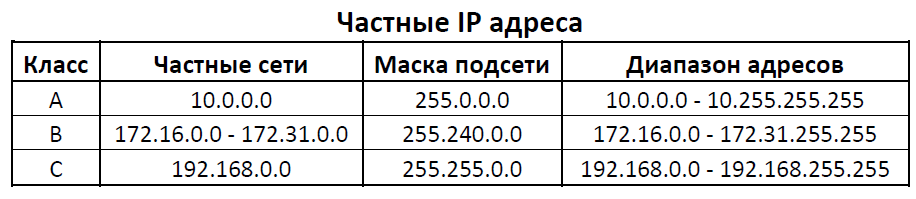
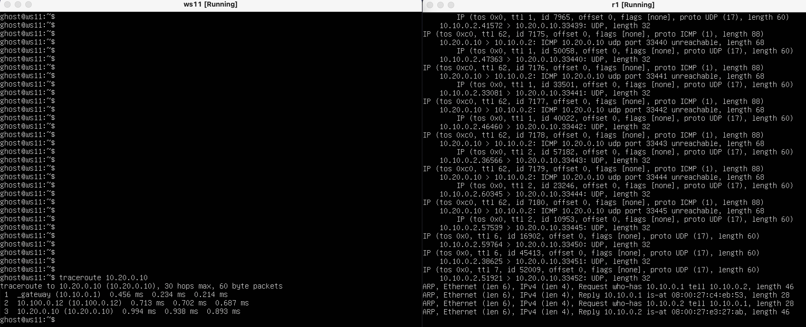

# Сети в Linux

## Contents

   2.1. [Стек протоколов TCP IP](#стек-протоколов-tcp-ip) \
   2.2. [Адресация](#адресация) \
   2.3. [Маршрутизация](#маршрутизация)
3. [Chapter III](#chapter-iii) \
   3.1. [Инструмент ipcalc](#part-1-инструмент-ipcalc) \
   3.2. [Статическая маршрутизация между двумя машинами](#part-2-статическая-маршрутизация-между-двумя-машинами) \
   3.3. [Утилита iperf3](#part-3-утилита-iperf3) \
   3.4. [Сетевой экран](#part-4-сетевой-экран) \
   3.5. [Статическая маршрутизация сети](#part-5-статическая-маршрутизация-сети) \
   3.6. [Динамическая настройка IP с помощью DHCP](#part-6-динамическая-настройка-ip-с-помощью-dhcp) \
   3.7. [NAT](#part-7-nat) \
   3.8. [Допополнительно. Знакомство с SSH Tunnels](#part-8-дополнительно-знакомство-с-ssh-tunnels)
4. [Chapter IV](#chapter-iv)


## Part 1. Инструмент **ipcalc**

##### Поднять виртуальную машину (далее -- ws1)

#### 1.1. Сети и маски

##### 1) Адрес сети *192.167.38.54/13* = 192.160.0.0


| Маска/адрес | Десятичный вид | Двоичный вид |
|---|---|---|
| маска подсети: |  255.248.0.0 | 11111111.11111000.00000000.00000000 |
| & | |
| адрес клиента: | 192.167.38.54 | 11000000.10100111.00100110.00110110 |
| = | |
| адрес сети:    |  192.160.0.0 | 11000000.10100000.00000000.00000000 |


##### 2) Перевод маски *255.255.255.0* в префиксную и двоичную запись, */15* в обычную и двоичную, *11111111.11111111.11111111.11110000* в обычную и префиксную

| Обычная запись | Двоичная запись | Префиксная запись |
|---|---|---|
| 255.255.255.0 | 11111111.11111111.11111111.00000000 | /24 |
| 255.254.0.0 | 11111111.11111110.00000000.00000000 | /15 |
| 255.255.255.240 | 11111111.11111111.11111111.11110000 | /28 |


##### 3) Минимальный и максимальный хост в сети *12.167.38.4* при масках: */8*, *11111111.11111111.00000000.00000000*, *255.255.254.0* и */4*

| Маска | Минимальный хост | Максимальный хост |
|---|---|---|
| /8 | 12.0.0.1 | 12.255.255.254 |
| 11111111.11111111.00000000.00000000 | 12.167.0.1 | 12.167.255.254 |
| 255.255.254.0 | 12.167.38.1 | 12.167.39.254 |
| /4 | 0.0.0.1 | 15.255.255.254 |


'''

'''
#### 1.2. localhost
##### Определить и записать в отчёт, можно ли обратиться к приложению, работающему на localhost, со следующими IP: *194.34.23.100*, *127.0.0.2*, *127.1.0.1*, *128.0.0.1*

- localhost - 127.0.0.1/8 (Узнал командой "cat /etc/hosts")

|IP-адрес|Возможность|
|---|---|
|194.34.23.100|False|
|127.0.0.2|True|
|127.1.0.1|True|
|128.0.0.1|False|

#### 1.3. Диапазоны и сегменты сетей
##### Определить и записать в отчёт:
##### 1) какие из перечисленных IP можно использовать в качестве публичного, а какие только в качестве частных: *10.0.0.45*, *134.43.0.2*, *192.168.4.2*, *172.20.250.4*, *172.0.2.1*, *192.172.0.1*, *172.68.0.2*, *172.16.255.255*, *10.10.10.10*, *192.169.168.1*



|IP-адрес|Публичный|Частный|
|---|---|---|
|10.0.0.45||+|
|134.43.0.2|+||
|192.168.4.2||+|
|172.20.250.4||+|
|172.0.2.1|+||
|192.172.0.1|+||
|172.68.0.2|+||
|172.16.255.255||+|
|10.10.10.10||+|
|192.169.168.1|+||


##### 2) какие из перечисленных IP адресов шлюза возможны у сети *10.10.0.0/18*: *10.0.0.1*, *10.10.0.2*, *10.10.10.10*, *10.10.100.1*, *10.10.1.255*

- *Шлюз - компьютер, осуществляющий взаимодействие с другими сетями. Диапазон возможных шлюзов для конкретной сети помечается в выводе ipcalc, начиная с HostMin и до HostMax (невключительно).*


|IP-адрес|Возможность для сети 10.10.0.0/18|
|---|---|
|10.0.0.1|False|
|10.0.0.2|True|
|10.10.10.10|True|
|10.10.100.1|False|
|10.10.1.255|True|


## Part 2. Статическая маршрутизация между двумя машинами

`-` Теперь разберёмся, как связать две машины, используя статическую маршрутизацию.

- Подняли 2 виртуальные машины. В настройках Virtual Box к каждой добавили Адаптер 2 - адаптер внутренней сети. Далее при вызове ip a увидим, что появился третий сетевой интерфейс как раз засчет добавления порта 2.


##### С помощью команды `ip a` посмотрим существующие сетевые интерфейсы

```bash
machine1@server:~$ ip a
1: lo: <LOOPBACK,UP,LOWER_UP> mtu 65536 qdisc noqueue state UNKNOWN group default qlen 1000
    link/loopback 00:00:00:00:00:00 brd 00:00:00:00:00:00
    inet 127.0.0.1/8 scope host lo
       valid_lft forever preferred_lft forever
    inet6 ::1/128 scope host
       valid_lft forever preferred_lft forever
2: enp0s3: <BROADCAST,MULTICAST,UP,LOWER_UP> mtu 1500 qdisc fq_codel state UP group default qlen 1000
    link/ether 08:00:27:6d:92:ee brd ff:ff:ff:ff:ff:ff
    inet 10.0.2.15/24 brd 10.0.2.255 scope global dynamic enp0s3
       valid_lft 85266sec preferred_lft 85266sec
    inet6 fe80::a00:27ff:fe6d:92ee/64 scope link
       valid_lft forever preferred_lft forever
3: enp0s8: <BROADCAST,MULTICAST> mtu 1500 qdisc noop state DOWN group default qlen 1000
    link/ether 08:00:27:d3:2b:27 brd ff:ff:ff:ff:ff:ff
```

```bash
machine2@server:~$ ip a
1: lo: <LOOPBACK,UP,LOWER_UP> mtu 65536 qdisc noqueue state UNKNOWN group default qlen 1000
    link/loopback 00:00:00:00:00:00 brd 00:00:00:00:00:00
    inet 127.0.0.1/8 scope host lo
       valid_lft forever preferred_lft forever
    inet6 ::1/128 scope host
       valid_lft forever preferred_lft forever
2: enp0s3: <BROADCAST,MULTICAST,UP,LOWER_UP> mtu 1500 qdisc fq_codel state UP group default qlen 1000
    link/ether 08:00:27:60:8c:d4 brd ff:ff:ff:ff:ff:ff
    inet 10.0.2.15/24 brd 10.0.2.255 scope global dynamic enp0s3
       valid_lft 86336sec preferred_lft 86336sec
    inet6 fe80::a00:27ff:fe60:8cd4/64 scope link
       valid_lft forever preferred_lft forever
3: enp0s8: <BROADCAST,MULTICAST> mtu 1500 qdisc noop state DOWN group default qlen 1000
    link/ether 08:00:27:5a:da:56 brd ff:ff:ff:ff:ff:ff
```

##### Опишем сетевой интерфейс, соответствующий внутренней сети, на обеих машинах и зададим следующие адреса и маски: ws1 - *192.168.100.10*, маска */16*, ws2 - *172.24.116.8*, маска */12*


```bash
machine1@server:~$ cat /etc/netplan/00-installer-config.yaml
# This is the network config written by 'subiquity'
network:
  ethernets:
    enp0s3:
      dhcp4: true
    enp0s8:
      dhcp4: false
      addresses: [192.168.100.10/16]
  version: 2
```

```bash
machine2@server:~$ cat /etc/netplan/00-installer-config.yaml
# This is the network config written by 'subiquity'
network:
  ethernets:
    enp0s3:
      dhcp4: true
    enp0s8:
      dhcp4: false
      addresses: [172.24.116.8/12]
  version: 2
```


##### Выполним команду `netplan apply` для перезапуска сервиса сети

```bash
$ netplan --debug apply  # для проверки на ошибки флаг debug
```


#### 2.1. Добавление статического маршрута вручную
##### Добавим статический маршрут от одной машины до другой и обратно при помощи команды вида `ip r add`


```bash
machine1@server:~$ sudo ip r add 172.24.116.8 dev enp0s8
```


```bash
machine2@server:~$ sudo ip r add 192.168.100.10 dev enp0s8
```


##### Проверим


#### 2.2. Добавление статического маршрута с сохранением

- После перезапуска пинганем и увидим, что машны не пингуются :(

```bash
machine1@server:~$ ping 172.24.116.8
PING 172.24.116.8 (172.24.116.8) 56(84) bytes of data.
^C
--- 172.24.116.8 ping statistics ---
10 packets transmitted, 0 received, 100% packet loss, time 9216ms
```

- Изменим файл *etc/netplan/00-installer-config.yaml*, дабы все изменения и после перезапуска оставались.


- Примем изменения с помощью sudo netplan apply и пропингуем соединение между машинами


## Part 3. Утилита **iperf3**

*В данном задании используются виртуальные машины ws1 и ws2 из Части 2*

#### 3.1. Скорость соединения

|Скорость|Перевод|Результат|
|---|---|---|
|8 Mbps|8/8|1 MB/s|
|100 MB/s|100 * 1024 * 8|819200 Kbps|
|1 Gbps|1 * 1024|1024 Mbps|


#### 3.2. Утилита **iperf3**
##### Измерить скорость соединения между ws1 и ws2


- iperf3 работает по клиент-серверной модели. Машина, скорость которой будем измерять - клиент. Другая машина будет играть роль сервера. На сервере запускаем команду

```bash
iperf3 -s
```

- На клиенте запускаем команду ниже, где <ip_addr> - адрес нашего сервера.

```bash
iperf3 -c <ip_addr>
```


## Part 4. Сетевой экран

`-` После соединения машин, перед нами стоит следующая задача: контролировать информацию, проходящую по соединению. Для этого используются сетевые экраны.

*В данном задании используются виртуальные машины ws1 и ws2 из Части 2*

#### 4.1. Утилита **iptables**

##### Создадим файл */etc/firewall.sh*, имитирующий фаерволл, на ws1 и ws2:

```bash
#!/bin/sh

# Удаление всех правил в таблице "filter" (по-умолчанию).
iptables –F  # Delete all rules in  chain or all chains
iptables -X  # Delete a user-defined chain

# Добавление новых правил, синтаксис
iptables -A {INPUT|OUTPUT} -p icmp -j {ACCEPT|REJECT|DROP}
iptables -A {INPUT|OUTPUT} -p icmp --icmp-type {echo-reply|echo-request} -j {ACCEPT|REJECT|DROP}

```


```bash
# Добавление портов
iptables -A INPUT -p tcp --dport 80 -j ACCEPT
iptables -A INPUT -p tcp --dport 22 -j ACCEPT
```
- -A  - append to chain
- -p - cетевой протокол. Допустимые варианты — TCP, UDP, ICMP или ALL
- --dport - порт назначения
- -j - target

iptables -A OUTPUT -p icmp --icmp-type echo-reply -j ACCEPT
iptables -A OUTPUT -p icmp --icmp-type echo-reply -j DROP

_И далее применим следующие команды: `chmod +x /etc/firewall.sh` и `/etc/firewall.sh`_


> Правила выполняются сверху-вниз, следовательно, разница между стратегиями в том, что если сначала идет правило запрета, то разрешение ниже не выполнится. Если же было разрешение, а потом запрет - то оба правила срабатывают и после выполнения файла получим запрет.


#### 4.2. Утилита **nmap**
##### Командой **ping** найдем машину, которая не "пингуется", после чего утилитой **nmap** покажем, что хост машины запущен
*Проверка: в выводе nmap должно быть сказано: `Host is up`*


## Part 5. Статическая маршрутизация сети

`-` Время для статической маршрутизации целой сети.


Сеть: \


#### 5.0 Подготовочка
- Создал я 5 новых машин полным клонированием машины из предыдущего пункта, на которой предустановил все необходимые в следующих пунктах утилиты. Также сменил логин с machine1 на ghost во избежание путаницы и для каждой машины поменял hostname, отредактировав файл /etc/hostname (и затем перезапустив систему).

- Для каждой машины отключил адаптер 1, отвечающий за интернет. Для роутеров в настройках добавил адаптер 3.

- _Очень важное замечание: на схеме опечатка для роутера 2: названия eth0, eth1 перепутаны местами_

#### 5.1. Настройка адресов машин


#### 5.2. Включение переадресации IP-адресов.

Параметр ip_forward отвечает за то, воспринимает ли себя машина как узел сети или же как маршрутизатор - то есть она - конечная точка передачи пакетов (параметр = 0) или должна их пытаться переслать дальше (=1).

`sysctl -w net.ipv4.ip_forward=1` - меняет форвардинг, но после ребута параметр снова =0.

`net.ipv4.ip_forward = 1` - меняет навсегда на =1.

Этот параметр также можно просмотреть в файле /proc/sys/net/ipv4/ip_forward.

- Полезная ссылка: https://qsetup.ru/linux-chto-takoye-ip-forward/


#### 5.3. Установка маршрута по-умолчанию
Пример вывода команды `ip r` после добавления шлюза:
```
default via 10.10.0.1 dev eth0
10.10.0.0/18 dev eth0 proto kernel scope link src 10.10.0.2
```
##### Для настройки шлюза уже были добавлены gateway4 \[ip роутера\] в файлы конфигураций.


##### Проверка вызовом  `ip r` 


##### Пропингуем с ws11 роутер r2 и покажем на r2, что пинг доходит. Для этого используем команду:
`tcpdump -tn -i eth1`


#### 5.4. Добавление статических маршрутов
##### Добавим в роутеры r1 и r2 статические маршруты в файле конфигураций. Пример для r1 маршрута в сетку 10.20.0.0/26:
```shell
# Добавить в конец описания сетевого интерфейса eth1:
- to: 10.20.0.0
  via: 10.100.0.12
```


##### Вызвать `ip r` и показать таблицы с маршрутами на обоих роутерах. Пример таблицы на r1:
```
10.100.0.0/16 dev eth1 proto kernel scope link src 10.100.0.11
10.20.0.0/26 via 10.100.0.12 dev eth1
10.10.0.0/18 dev eth0 proto kernel scope link src 10.10.0.1
```


##### Запустим команды на ws11:
`ip r list 10.10.0.0/[маска сети]` и `ip r list 0.0.0.0/0`


> Для адреса 10.10.0.0/18 был выбран маршрут, отличный от 0.0.0.0/0 (хотя он попадает в маршрут по умолчанию) по принципу наибольшего совпадения масок.

#### 5.5. Построение списка маршрутизаторов
##### Traceroute

- Запустим на r1 команду дампа:
`tcpdump -tnv -i eth0`
- При помощи утилиты **traceroute** построим список маршрутизаторов на пути от ws11 до ws21



**Идея *traceroute***
| Термин | Описание |
| --- | --- |
| UDP | протокол трассировки. В каждом запросе есть порт отправителя (Sourсe) и порт получателя (Destination) |
| ICMP | протокол третьего уровня, и о портах он не знает ничего. ICMP-сообщения отправляются  конечным хостом в трассировке в двух вариантах: 1) время вышло = хост назначения не достигнут;  2) порт назначения недоступен = цель достигнута |
| TTL | параметр, которым снабжается каждый отправленный пакет,  = максимальному числу шагов по маршрутизаторам (дабы пакет не ходил по сети вечно в случаи каких-либо проблем). Максимальное значение TTL=255, обычно при отправке  30. |

> *Traceroute формирует UDP-датаграмму (сообщение, которое нужно доставить целевому серверу). Далее он посылает на порт назначения сразу несколько пакетов c TTL = 1, 2,… Пакет с TTL = n попадает на хост и его TTL уменьшается на 1, а также пересылается дальше по сети до тех пор, пока целевой ip (куда собственно направляем пакет) не совпадет с ip хоста. В случае совпадения айпишников узел возвращает обратно сообщение «Destination port unreachable» (порт назначения недоступен). Это значит, что адресат получил запрос. Traceroute воспримет этот ответ как завершение трассировки. Иначе конечный хост (при TTL=0) отправит сообщение о том, что время истекло и будет предпринята новая попытка трассировки.*
> 

Как видим из скриншота, при уменьшении TTL до 63 достигнуть цели не удалось (1 шаг), однако уже при двух шагах хост назначения был достигнут *(в обычной практике обратный TTL равен 64, или 128, или 255. Наш случай - 64.)*

Это совпадает с схемой реализованной сети - машины ws11 и ws21 разделяет 2 маршрутизатора, через которые и проложен маршрут. Так, на каждом роутере TTL уменьшался на 1, и при исходном TTL=1 (прямой TTL) трассировка завершилась провалом *(сообщение “ICMP time exceeded in-transit”)* - нужный хост не был достигнут. При следующей же попытке с пакетами, TTL которых был равен 2, мы во всех случаях получили сообщение с “port unreachable”, что означает успех.
#### 5.6. Использование протокола **ICMP** при маршрутизации
##### Запустим на r1 перехват сетевого трафика, проходящего через eth0 с помощью команды:
`tcpdump -n -i eth0 icmp`
##### Пропингуем с ws11 несуществующий IP (например, *10.30.0.111*) с помощью команды:
`ping -c 1 10.30.0.111`


## Part 6. Динамическая настройка IP с помощью **DHCP**
_Ссылка: https://www.opennet.ru/base/net/dhcp_setup.txt.html_

**== Задание ==**

_Перед тем, как отключать внешнюю сеть, было необходимо установить нужные пакеты:_
```bash
sudo apt install isc-dhcp-server
sudo apt install resolvconf
```
1) На прежнем поле работы с теми же машинами открываем */etc/dhcp/dhcpd.conf* для r2 и редактируем его, как указано в задании:

```shell
subnet 10.100.0.0 netmask 255.255.0.0 {}

subnet 10.20.0.0 netmask 255.255.255.192
{
    range 10.20.0.2 10.20.0.50;
    option routers 10.20.0.1;
    option domain-name-servers 10.20.0.1;
}
```


2) В файле *resolv.conf* прописываем `nameserver 8.8.8.8.`


- Перезагрузим службу **DHCP** командой `systemctl restart isc-dhcp-server`. Машину ws21 перезагрузим при помощи `reboot` и через `ip a` покажем, что она получила адрес. 


_Итог: айпишник изменился с 10.20.0.2 на 10.20.0.3_

- Пропингуем ws22 с ws21.


##### Жесткая привязка к мак-адрессу
1) Если мак-адрес отличен от желаемого, то через менеджер в настройках машины можно его изменить (Адаптер -> дополнительно -> мак-адрес) 

2) В *etc/netplan/00-installer-config.yaml* добавим строчки `macaddress: 10:10:10:10:10:BA`, `dhcp4: true`


3) Для жесткой настройки r1 с мак-адресом ws11 используем следующую конструкцию в dhcpd.conf:

```bash
host myhost {
               hardware ethernet xx:xx:xx:xx:xx:xx;
               fixed-address 192.168.0.9;
           }
```


4) Проверим айпишник ws11 до и после ребута:


_Итог: айпишник изменился с 10.20.0.2 на 10.10.0.53 (до этого было 20, а не 10, так как второй роутер назначил айпишник)_

##### Обновление айпишника без ребута

_Для этого достаточно запустить 2 команды с рассматриваемой машины:_

```bash
dhclient -r eth0    # чистка старых конфигураций DHCP

dhclient -v eth0    # запрос новых конфигураций
```


## Part 7. **NAT**

*В данном задании используются виртуальные машины из Части 5*


*Очень полезная сслыка для желающих почитать документацию на русском про iptables: [https://www.opennet.ru/docs/RUS/iptables/](https://www.opennet.ru/docs/RUS/iptables/)*

| Метод | Описание |
| --- | --- |
| DNAT | механизм подмены адреса получателя (перенаправление на адрес, отличный от того, что указан в заголовке пакета) |
| SNAT | механизм подмены адреса отправителя при пересылке пакета |

*Нам надо*

| Метод | Что сделать |
| --- | --- |
| DNAT | включить на порт 8080  |
| SNAT | замаскировать все локальные айпишники из нашей сетки, которые находятся за r2 (по обозначениям из Части 5 - сеть 10.20.0.0) |

| Критерий, ключ | Описание |
| --- | --- |
| POSTROUTING | =выходящие запросы. Цепочка, которая используется для преобразования пакетов перед выдачей их в сеть. |
| PREROUTING | =входящие запросы. Цепочка, которая используется для внесения изменений в пакеты на входе в брандмауэр. |
| -t (-t nat) | Указывает на используемую таблицу. Используем NAT (Network Address Translation) для преобразования сетевых адресов. |
| -i, --in-interface | Интерфейс, с которого был получен пакет. Использование этого критерия допускается только в цепочках INPUT, FORWARD и PREROUTING, в любых других случаях будет вызывать сообщение об ошибке. При отсутствии этого критерия предполагается любой интерфейс. |
| -o, --out-interface | Задает имя выходного интерфейса. Этот критерий допускается использовать только в цепочках OUTPUT, FORWARD и POSTROUTING, в противном случае будет генерироваться сообщение об ошибке. При отсутствии этого критерия предполагается любой интерфейс. |
| -s, --src, --source | IP-адрес(а) источника пакета. Адрес источника может указываться так, как показано в примере, тогда подразумевается единственный IP-адрес. А можно указать адрес в виде address/mask, например как 192.168.0.0/24, т.е. фактически определяя диапазон адресов. |
| --to-source | Ключ --to-source используется для указания адреса, присваемого пакету. Все просто, вы указываете IP адрес, который будет подставлен в заголовок пакета в качестве исходящего. |
| --to-destination | Ключ --to-destination указывает, какой IP адрес должен быть подставлен в качестве адреса места назначения. |
| -A | добавление новых правил |
| -j | добавление перехода в правилах |
1. SNAT. Замаскируем айпишники, стоящие за r2. Данная маскировка нужна при выходе во внешнюю сеть из r2, то есть у нас цепочка POSTROUTING для out-interface = eth1. Маскируемые айпишники из сети 10.20.0.0/26, то есть “-s 10.20.0.0/26”. Наконец, для маскировки мы используем механизм SNAT и подменять все айпишники будем на 10.100.0.12 - внешний айпишник r2. Получим:

```bash
iptables -t nat -A POSTROUTING -s 10.20.0.0/26 -o eth1 -j SNAT --to-sourсe 10.100.0.12
```

1. DNAT. Нам нужно связать “жильцов” локальной сети r2 с портами, чтобы при поступлении запроса пакет направлялся на конкретный порт, на котором находился адресат. Жилец ws22 был привязан пунктом выше, когда настроили apache на 80 порт. Теперь создадим правило для r2, чтобы он знал, куда (на какой порт) нести почту, если поступил запрос на порт 8080.

```bash
iptables -t nat -A PRETROUTING -p tcp -i eth1 --dport 8080 -j DNAT --to-destination 10.20.0.20:80
```

_Также разрешим маршрутизацию icmp, tcp пакетов_

```bash
iptables -A FORWARD -p icmp -j ACCEPT
iptables -A FORWARD -p tcp -j ACCEPT
```


## Part 8. Дополнительно. Знакомство с **SSH Tunnels**

*В данном задании используются виртуальные машины из Части 5*

### SSH-Tunnels

Переброс порта SSH устанавливает туннель между несколькими системами, через который может происходить обмен пакетами. SSH=Secure shell - защищенная передача данных (они шифруются) с проверкой на целостность переданой информации (ничего ли не повредилось). 

| Тип переброса | Описание |
| --- | --- |
| Локальный переброс (c ws21 (клиент) до ws22 (сервер)) -L local_listen_port:destination_host:destination_port server_host | Если на системе стоит файервол, запрещающий прямые соединения извне, но есть доступ по ssh (по умолчанию, порт 80), то локальный переброс - то, что нам нужно, надо только установить доступ по ssh. |
| Удаленный переброс (c ws11 (сервер) до ws22 (клиент)) | Если хост не имеет белого айпишника, находится за NAT или вообще все входящие соединения к нему закрыты, то тогда используем Remote TCP forwarding. Здесь установка соединения идет в обратном направлении. |

#### Local TCP forwarding
1. Настроили apache на ws22 на прослушивание 80 порта


2. На ws21 прописали локальный проброс портов (9999 выбран произвольно, 80 - нет, так как в апаче указывали)

```sh
ssh -L 9999:localhost:80 loretath@10.20.0.20
```

_Вывод команды получился слишком большим, но важно что будучи на ws21 мы переключились на ws22. Именно поэтому и в задании сказано, что нужно открыть новое окно терминала - там мы залогинимся как ws21 и проверим соединение телнетом_

3. Проверим подключение
```sh
telnet 127.0.0.1 9999
```


#### Remote TCP forwarding

_Делаем во многом аналогичные действия, но наоборот - на другой машине (ws22). В команде ssh изменен флаг, добавлен fN, чтобы в фоне делать проброс портов._

```sh
ssh -R 1234:localhost:80 loretath@10.10.0.2 -fN
```


### Дополнительно. Настройка ssh-портов для работы с терминала мака.

- В настройках VB для адаптера 1 (NAT) выбираем "проброс портов" и добавляем порт хоста (произвольный от 1000, пусть будет 3333) и порт гостя (22, так как ssh). В терминале машин вводим 


```bash
service ssh status
```
- В терминале на маке вводим (3333 - порт хоста, заданный выше, ws1 - название машины)

```bash
ssh -p 3333 ws1@localhost
```
- Готово! Теперь можно удобно работать с привычного терминала, листать его и юзать ctrl+c, ctrl+v.


